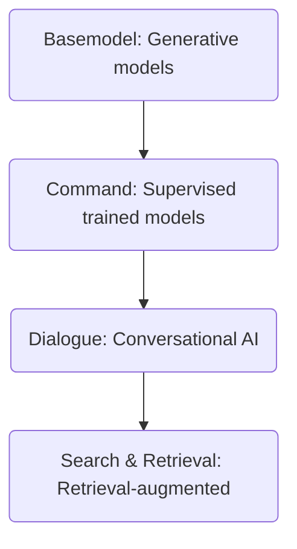

# Foundation models definition
> Models trained on broad data (generally using self-supervision at scale) that can be adapted to a wide range of downstream tasks[^1]
# Training
Using:
1. Self-supervises learning
2. Scale
# Unifying tasks
- Question answering
- Sentiment classification
- Translation
- Coreference resolution
- Parsing
# Potential Harms
- Generate offensive content
- Generate untruthful content
- Enable disinformation/malicious
# Use of foundation models
- Linear probing
  > :notebook:
  > Simple and efficient, model must be very good
- (Full)Fine-tuning
  > :notebook:
  > Best method when we have lots of data, lots of memory
- Prefix-Tuning/Prompt-Tuning (consume less memory than Fine-tuning)
  > :notebook:
  > Good for mid-sized datasets, memory-efficient
- Zero-shot Prompting
  > :notebook:
  > Open ended task (no dataset collection), need to engineer prompts, accuracy can be low
- In-context Learning
  > :notebook:
  > Open ended task (minimal dataset collection), accuracy can be lower than tuning methods
- Chain-of-Thought
# Fine-tuning methods
Why? fine-tuning can decreasing cost of use
1. Finetune LLM
   Behave in certain way  
2. Knowledge base Embedding
   Gain domain knowledge
# Transformers
1. Training model 1
  GPT-LLM-Trainer, through Google Colab
- Prepare data: Dataset Generation: Using GPT-4, gpt-llm-trainer will generate a variety of prompts and responses based on the provied use-case
- System Message Generation: gpt-llm-trainer will generate an effective system prompt for your model
- Fine-tuning: After your dataset has been generated, the system will automatically split it into training and validation sets, fine-tune a model for you, and get it ready for inference
  > [tut](https://www.youtube.com/watch?v=pRq2Fx4kYQI)


| Terms | Definition |
| ---| --- |
| temperature | Entropy (?) high = creative, Low = precise |
| number_of_examples | min ~100, the more the better for higher-quality model |

2. Training model 2
   autotrain, through Google Colab
- use-4bit (int4)
  > [tut](https://www.youtube.com/watch?v=3fsn19OI_C8)
```
autotrain llm --train --project_name 'llama2-openassistant'
--model TinyPixel/Llama-2-7B-bf16-shared #using sharded model helps when you're low on VRAM. It will not load the model all at once
--data_path timdettmers/openassistant-guanaco #huggingface git repo id or local path all work with this. each model requires certain dataset format
--text_column text # name of the column
--use_peft #fine-tuning method. In this case, it's PEFT: Parameter-Efficient Fine-tuning methods (by huggingface)
--use_int4 #precision. In this case, it's 4bit precision
--learning_rate 2e-4 #the speed of conversion during training process. Lower value takes longer, but converge better
--train_batch_size 2 # raise this value for smaller dataset. for instance, 4. This depends on number of GPUs and amount of VRam
--num_train_epochs 3 # higher value for better quality
--trainer sft # trainer method. In this case, it's supervised fine-tunning. Works with input-output data format
--model_max_length 2048 # related to context-window (2k, 4k tokens...). llama2 models have 4096tokens context-windows. value of 2048 here will speed up training process
--pus_to_hub #push to huggingface hub
--repo_id Promptengineering/llama2-openassistant #if push to hub enabled, repo id needs to be filled
--block_size 2048 > training.log &
```
- after tokenizing process done, config.json will be created. The model is then be loaded using Transformer library
- source of explaination [explain](https://www.youtube.com/watch?v=LslC2nKEEGU)

| Terms | Definition |
| ---| --- |
| auto-train | huggingface/autotrain-advanced library |

3. Training model 3
   [tut](https://www.youtube.com/watch?v=Q9zv369Ggfk)
# Large Language Model Technology stack


# Foundation models
1. BERT
2. RoBERTa
3. GPT-2
4. T5
5. Turing NLG
6. GPT-3

| Organization | Models |
|---|---|
| OpenAI | GPT-3, Codex, DALL-E, CLIP |
| Meta | OPT |
| AI21labs | Jurassic |
| HuggingFace + BigSciece | BLOOM |
| Nvidia + Microsoft | MT-NLG |
| Stability.ai | Stable diffusion |
| BAAI | Wu Dao 2.0 |
| EleutherAI | GPT-NeoX |
| DeepMind | Gopher, Chinchilla |
| Huawei | PanGu-Alpha |
| Naver | HyperCL, OVA |
| Google | PaLM, MUM |
[^1]: ["Introducing the Center for Research on Foundation Models (CRFM)"](https://hai.stanford.edu/news/introducing-center-research-foundation-models-crfm) Stanford HAI. Retrieved 11 June 2022.
